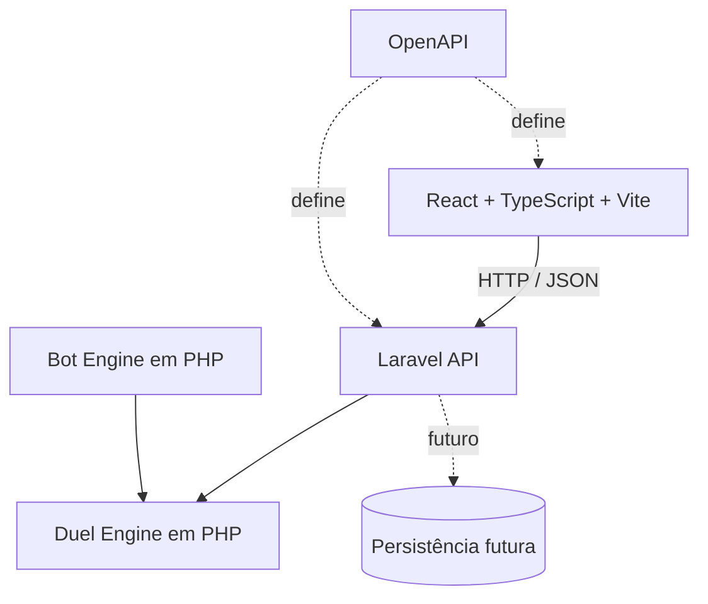

<a id="readme-top"></a>

<div align="center">
  <h1>Duel Legacy</h1>

  <p>
    Jogo de cartas web single-player inspirado na experiência clássica/GX de
    Yu-Gi-Oh!, com campanha, progressão, coleção, construção de Decks, loja,
    bots estratégicos e duelos animados.
  </p>

  <p>
    
    
    
  </p>

  <p>
    
    
    
  </p>

  <p>
    
    
    
    
    
    
    
    
    
    
  </p>
</div>

> [!IMPORTANT]
> O Duel Legacy está na fase de **fundação**. O backend e as regras já foram
> migrados para PHP, mas ainda não existe uma partida visual completa. Este é
> um projeto não oficial, destinado a estudo e desenvolvimento, e o repositório
> não distribui imagens oficiais, cartas ou outros recursos protegidos da
> Konami.

## Sumário

- [Visão geral](#visão-geral)
- [Referências](#referências)
- [Estado atual](#estado-atual)
- [Funcionalidades implementadas](#funcionalidades-implementadas)
- [Arquitetura](#arquitetura)
- [Estrutura do repositório](#estrutura-do-repositório)
- [Backend e regras](#backend-e-regras)
- [Determinismo](#determinismo)
- [Testes e qualidade](#testes-e-qualidade)
- [Tecnologias](#tecnologias)
- [Como executar](#como-executar)
- [Roadmap](#roadmap)
- [Limitações](#limitações)
- [Aviso legal](#aviso-legal)

## Visão geral

O Duel Legacy pretende oferecer uma experiência single-player completa no
navegador. A visão do produto inclui campanha e progressão, duelistas
desbloqueáveis, coleção persistente, múltiplos Decks, Deck Builder, loja,
abertura de pacotes, Duel Points, recompensas, bots com diferentes Decks e
estratégias, sons e animações.

Essa é a **visão planejada**, não uma descrição do produto disponível hoje. O
trabalho atual está concentrado na base técnica: regras determinísticas,
estados imutáveis, fluxo de turnos, integração HTTP e qualidade automatizada.

## Referências

As principais referências de experiência são:

- _Yu-Gi-Oh! 5D's Tag Force 4_ e outros jogos da série _Tag Force_;
- _Yu-Gi-Oh! Online BR_;
- _YGO Duelix_.

Para as regras, o desenvolvimento consulta livros oficiais de regras do
Yu-Gi-Oh! TCG publicados pela Konami, a base oficial de cartas e materiais
oficiais sobre fases, zonas, Invocações e resolução de jogadas.

`GX_LEGACY` é um perfil próprio do projeto para organizar o recorte de regras
clássico/GX. Ele evita misturar automaticamente mecânicas posteriores, como
Sincro, Xyz, Pêndulo e Link, sem alegar afiliação, aprovação ou licenciamento
pela Konami.

## Estado atual

### ✅ Implementado

- monorepo com frontend, API, motores e contratos separados;
- frontend React + TypeScript + Vite;
- API Laravel com `GET /health`;
- `duel-engine` em PHP e `bot-engine` em PHP;
- contratos OpenAPI 3.1;
- perfil `GX_LEGACY`;
- estados dos dois jogadores e estado do Duelo;
- validação das zonas e IDs únicos de instâncias de cartas;
- preparação e embaralhamento determinísticos;
- mãos iniciais;
- Fase de Compra e ausência de compra inicial;
- Deck Out;
- Fase de Apoio;
- entrada e transições da Fase Principal 1;
- bloqueio da Fase de Batalha no primeiro turno;
- Fase Final;
- alternância entre jogadores e início do próximo turno;
- controle de Invocação-Normal;
- cálculo do excesso de cartas na mão.

### 🚧 Em desenvolvimento

- descarte obrigatório na Fase Final;
- conclusão do processamento da Fase Final;
- comandos e eventos de Duelo;
- modelo completo de cartas;
- geração de ações legais;
- primeira interface de depuração do Duelo.

### 🧭 Planejado

- Invocações completas;
- Magias, Armadilhas, efeitos e Correntes;
- batalha e condições de vitória;
- bots estratégicos;
- campanha, coleção, loja, pacotes e persistência;
- interface animada.

## Funcionalidades implementadas

| Área             | Entregas atuais                                                                                    |
| ---------------- | -------------------------------------------------------------------------------------------------- |
| Fundação         | Monorepo, contratos OpenAPI, API Laravel e pacotes Composer separados                              |
| Perfil de regras | `GX_LEGACY`, 8.000 LP, mão inicial de 5 cartas, limites de Deck e zonas                            |
| Estado           | Jogadores, Duelo, zonas, fases, posições, identificadores e validações estruturais                 |
| Aleatoriedade    | Seed explícita, RNG reproduzível, serialização e Fisher–Yates determinístico                       |
| Preparação       | Embaralhamento dos dois Decks, distribuição das mãos e início do primeiro turno                    |
| Fluxo            | Compra, Deck Out, Apoio, Principal 1, Fase Final e troca estrutural de turno                       |
| Restrições       | Sem compra nem batalha no primeiro turno, controle de Invocação-Normal e consulta do limite da mão |
| Integração       | Health check público e teste do carregamento do motor pela aplicação Laravel                       |

O escopo implementado ainda é estrutural. Efeitos de cartas, resolução de
Correntes e uma partida completa não fazem parte da entrega atual.

## Arquitetura



- O frontend apresenta o estado e envia intenções; ele não decide se uma ação é
  legal.
- A API será a autoridade de cada Duelo, sem colocar regras nos controllers
  Laravel.
- O `duel-engine` é independente de Laravel, HTTP, banco, frontend e
  autenticação.
- O `bot-engine` pode depender do `duel-engine`; a dependência inversa é
  proibida.
- Banco de dados e persistência ainda não foram adicionados.
- Mãos, Decks e outras informações ocultas devem passar por uma projeção segura
  e nunca ser enviadas ao adversário.

## Estrutura do repositório

```text
duel-legacy/
├── apps/
│   ├── web/
│   └── api/
├── packages/
│   ├── duel-engine/
│   ├── bot-engine/
│   └── shared-contracts/
├── scripts/
├── package.json
├── pnpm-workspace.yaml
└── README.md
```

| Caminho                     | Responsabilidade                                           |
| --------------------------- | ---------------------------------------------------------- |
| `apps/web`                  | Interface React, TypeScript e Vite                         |
| `apps/api`                  | Adaptação HTTP com PHP e Laravel                           |
| `packages/duel-engine`      | Regras puras, determinísticas e independentes de framework |
| `packages/bot-engine`       | Fundação PHP para bots que escolherão entre ações legais   |
| `packages/shared-contracts` | Contratos neutros em OpenAPI 3.1                           |
| `scripts`                   | Orquestração das validações do monorepo                    |

## Backend e regras

`apps/api` usa PHP e Laravel, enquanto `packages/duel-engine` é PHP puro e
`packages/bot-engine` fornece a fundação PHP dos bots. Cada projeto PHP é
gerenciado pelo Composer e utiliza autoload PSR-4.

Os arquivos autorais PHP declaram `strict_types=1`. O domínio utiliza classes
`readonly` e enums para representar estados e conceitos de regra. Controllers
Laravel permanecem limitados à camada HTTP e não contêm regras de Duelo.

```text
Interface
   ↓
API Laravel
   ↓
Validação e comandos
   ↓
Duel Engine PHP
   ↓
Novo estado + eventos futuros
```

Essa divisão mantém transporte, apresentação e regras independentes. O servidor
recebe uma intenção, valida a jogada no motor e, futuramente, devolverá o novo
estado permitido junto aos eventos necessários para a interface.

## Determinismo

A aleatoriedade do Duelo é controlada por uma `seed`. O hash FNV-1a deriva o
estado inicial, o `xorshift32` produz a sequência pseudoaleatória e o algoritmo
Fisher–Yates usa essa sequência para embaralhar os Decks.

Com as mesmas entradas e a mesma `seed`, o motor reproduz a mesma sequência.
Isso simplifica testes e depuração e prepara a base para replays futuros. A
implementação PHP também mantém paridade bit a bit com os vetores históricos da
versão TypeScript, incluindo o tratamento de unidades UTF-16 usado na derivação
do estado inicial.

O RNG foi projetado para repetibilidade do jogo, não para uso criptográfico.

## Testes e qualidade

| Suíte atual   |  Testes | Assertions |
| ------------- | ------: | ---------: |
| `duel-engine` |     368 |      6.439 |
| API Laravel   |       2 |          4 |
| **Total**     | **370** |  **6.443** |

O motor possui **20 classes de teste** e **16 DataProviders**. O teste isolado
de paridade executa **4 testes e 193 assertions**, cobrindo RNG, embaralhamento,
serialização e fluxo estrutural contra os vetores preservados da migração.

A implementação TypeScript anterior possuía **606 casos Vitest**. Essa suíte
serviu como baseline histórico durante a migração; ela não representa a
contagem da suíte PHP atual.

| Verificação     | Escopo                             |
| --------------- | ---------------------------------- |
| PHPUnit         | `duel-engine` e API                |
| PHPStan nível 8 | motor, API, bot e testes           |
| Laravel Pint    | código PHP                         |
| ESLint          | frontend e scripts                 |
| TypeScript      | frontend                           |
| Prettier        | frontend, Markdown e configurações |
| Composer        | manifests e autoload PSR-4 estrito |

## Tecnologias

### Frontend

- React 19;
- TypeScript 6;
- Vite 8;
- pnpm 11.

### Backend

- PHP 8.3 ou superior;
- Laravel 13;
- Composer 2.

### Domínio

- PHP puro;
- autoload PSR-4;
- classes `readonly`;
- enums;
- RNG determinístico.

### Qualidade

- PHPUnit 13;
- PHPStan nível 8;
- Laravel Pint;
- ESLint;
- Prettier.

### Contratos

- OpenAPI 3.1.

## Como executar

### Pré-requisitos

- Node.js compatível com Vite 8;
- pnpm 11;
- PHP 8.3 ou superior;
- Composer 2.

### Instalação

```bash
git clone https://github.com/auhauhbr/duel-legacy-jogo-yu-gi-oh.git
cd duel-legacy-jogo-yu-gi-oh
pnpm install
composer install --working-dir=packages/duel-engine
composer install --working-dir=packages/bot-engine
composer install --working-dir=apps/api
```

### Desenvolvimento

Frontend:

```bash
pnpm dev:web
```

API Laravel:

```bash
pnpm dev:api
```

A API é iniciada na porta `3000`. O único endpoint disponível atualmente é
`GET http://localhost:3000/health`.

### Validação

```bash
pnpm build
pnpm test
pnpm lint
pnpm typecheck
pnpm format:check
```

| Comando             | O que verifica                                                                     |
| ------------------- | ---------------------------------------------------------------------------------- |
| `pnpm build`        | Compila o frontend, valida os manifests Composer, o autoload PSR-4 e a sintaxe PHP |
| `pnpm test`         | Executa PHPUnit no `duel-engine` e na API Laravel                                  |
| `pnpm lint`         | Executa ESLint, PHPStan nível 8 e Pint em modo de verificação                      |
| `pnpm typecheck`    | Executa TypeScript no frontend e PHPStan no motor, bot e API                       |
| `pnpm format:check` | Executa Prettier e Pint sem alterar arquivos                                       |

Não é necessário configurar banco de dados para iniciar a API, consultar o
health check ou executar a suíte atual.

## Roadmap

### Fundação concluída

- monorepo e contratos neutros;
- regras básicas, estados, fases e turnos;
- RNG e embaralhamento determinísticos;
- migração do backend e dos motores para PHP;
- testes automatizados e ferramentas de qualidade.

### Próximas etapas

- descarte obrigatório da Fase Final;
- fechamento completo do turno;
- modelo de cartas;
- ações legais;
- comandos e eventos;
- projeção segura de estado;
- interface de depuração.

### Duelo jogável

- Invocação-Normal e Baixar;
- posições de batalha;
- ataques e cálculo de dano;
- destruição;
- vitória por LP;
- bot simples.

### Experiência completa

- efeitos e Correntes;
- Magias e Armadilhas;
- Ritual e Fusão;
- campanha e coleção;
- loja, pacotes e Duel Points;
- áudio e animações.

Persistência relacional e comunicação em tempo real poderão ser avaliadas nos
marcos correspondentes, sem serem tratadas como tecnologias atuais.

## Limitações

- a API expõe somente `GET /health`;
- não há banco de dados;
- não há autenticação;
- não há persistência;
- não há WebSocket;
- o bot ainda não possui estratégia;
- não há mesa visual jogável;
- não há modelo completo de efeitos;
- os value objects de identificadores ainda não estão integrados a todas as
  assinaturas internas;
- a garantia de imutabilidade genérica não significa clone profundo de objetos
  mutáveis arbitrários.

## Aviso legal

O Duel Legacy é um projeto não oficial, sem vínculo, aprovação ou licenciamento
da Konami. Yu-Gi-Oh! e seus elementos relacionados pertencem aos respectivos
titulares.

O repositório não deve incluir imagens de cartas, áudios, logotipos ou outros
recursos oficiais protegidos. O projeto é destinado exclusivamente a estudo e
desenvolvimento.

<p align="right">(<a href="#readme-top">voltar ao topo</a>)</p>
