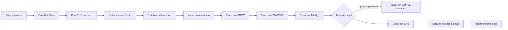
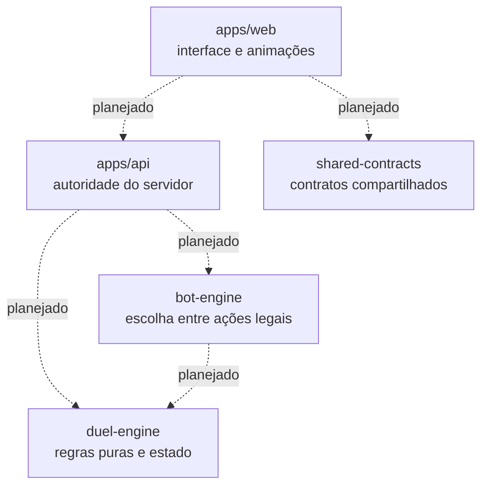

<a id="readme-top"></a>

<div align="center">
  <h1>Duel Legacy</h1>

  <p>
    Jogo de cartas web inspirado na era clássica/GX, com campanha, coleção,
    Deck Builder, loja, bots estratégicos e duelos animados sobre um motor
    próprio em TypeScript.
  </p>

  <p>
    
    
    
  </p>

  <p>
    
    
    
    
    
    
  </p>
</div>

> [!IMPORTANT]
> O projeto está na fase de fundação. O motor já cobre estados, preparação e o
> fluxo estrutural inicial de um Duelo, mas ainda não existe uma partida visual
> jogável. Campanha, coleção persistente, loja, bots, cartas completas, batalha,
> Correntes e animações fazem parte das próximas etapas.

## Sumário

- [Sobre o projeto](#sobre-o-projeto)
- [Visão do produto](#visão-do-produto)
- [Estado atual do desenvolvimento](#estado-atual-do-desenvolvimento)
- [Fluxo atualmente suportado](#fluxo-atualmente-suportado)
- [Arquitetura](#arquitetura)
- [Organização do motor](#organização-do-motor)
- [Determinismo e imutabilidade](#determinismo-e-imutabilidade)
- [Stack atual](#stack-atual)
- [Stack planejada](#stack-planejada)
- [Decisões e objetivos de engenharia](#decisões-e-objetivos-de-engenharia)
- [Números do projeto](#números-do-projeto)
- [Etapas do desenvolvimento](#etapas-do-desenvolvimento)
- [Roadmap](#roadmap)
- [Instalação e comandos](#instalação-e-comandos)
- [Testes e qualidade](#testes-e-qualidade)
- [Limitações atuais](#limitações-atuais)
- [Propriedade intelectual](#propriedade-intelectual)

## Sobre o projeto

Duel Legacy está sendo construído como um jogo de cartas web single-player
inspirado na experiência clássica e na era GX. A proposta combina campanha,
progressão, coleção de cartas, montagem de múltiplos Decks, loja, abertura de
pacotes e duelos contra personagens com estilos próprios.

O centro técnico do projeto é um motor de Duelo próprio, escrito em TypeScript
e separado da interface. Ele trabalha com entradas explícitas, valida regras e
produz novos estados de forma reproduzível. Essa base foi pensada para testes
automatizados, autoridade futura do servidor, depuração e replays.

O projeto, portanto, não pretende ser apenas um motor isolado. O motor é a base
de uma experiência completa em navegador: montar um Deck, conquistar cartas,
enfrentar duelistas, receber recompensas e acompanhar cada jogada com feedback
visual e sonoro.

## Visão do produto

Quando completo, o jogo pretende oferecer uma jornada single-player na qual o
jogador poderá:

- avançar por uma campanha e desbloquear duelistas e dificuldades;
- evoluir um perfil, conquistar recompensas e acumular Duel Points;
- manter uma coleção, criar múltiplos Decks e usar um Deck Builder com
  validação;
- comprar e abrir pacotes em uma loja interna, sem microtransações planejadas;
- enfrentar bots com Decks, prioridades e estratégias próprias;
- jogar Duelos completos com Invocação-Normal, Baixar, Invocação-Tributo,
  Ritual e Fusão;
- usar Magias, Armadilhas, efeitos, alvos e Correntes;
- declarar ataques, resolver cálculo de batalha e alcançar condições de
  vitória;
- acompanhar animações de compra, Invocação, ataque, destruição e redução de
  Pontos de Vida;
- receber sons, indicadores de fase e feedback visual das ações;
- futuramente, depois da estabilização do motor, explorar uma possível camada
  de PvP.

Essa lista descreve a visão e o roadmap. A maior parte da experiência de
produto ainda não está implementada.

### Experiência planejada para o jogador

```text
Receber um Deck inicial
        ↓
Escolher um duelista e uma dificuldade
        ↓
Jogar um Duelo completo contra um bot
        ↓
Ganhar Duel Points, experiência e recompensas
        ↓
Abrir pacotes e ampliar a coleção
        ↓
Criar e aprimorar Decks
        ↓
Desbloquear novos desafios e continuar a campanha
```

## Estado atual do desenvolvimento

### Implementado

O `duel-engine` é atualmente a parte mais avançada do repositório. Ele já
oferece:

- perfil `GX_LEGACY` imutável e sua validação estrutural;
- parâmetros de 8000 Pontos de Vida, mão inicial de 5 cartas, limite de mão de
  6, Deck Principal de 40 a 60 cartas e Deck Adicional de até 15;
- cinco Zonas de Monstro, cinco Zonas de Magia e Armadilha e Zona do Campo;
- declaração, no perfil, de Normal, Tributo, Baixar, Flip, Especial por efeito,
  Ritual e Fusão como métodos habilitados — os procedimentos de Invocação ainda
  não estão implementados;
- tipos de localização e posição de cartas;
- `DuelPlayerState` e `DuelState` com jogadores, áreas, ordem de turno, fase,
  resultado e estado do RNG;
- validações de dois jogadores, IDs distintos, ordem de turno, dimensões das
  zonas e unicidade global das instâncias de carta;
- seis fases do turno, quatro etapas estruturais de batalha e cinco janelas da
  Etapa de Dano modeladas como tipos e ordens imutáveis;
- RNG determinístico baseado em seed, FNV-1a de 32 bits e `xorshift32`;
- geração de inteiros e valores fracionários reproduzíveis;
- embaralhamento Fisher–Yates determinístico;
- convenção do índice zero como topo do Deck Principal;
- compra imutável de uma ou mais cartas;
- preparação do Duelo com embaralhamento dos dois Decks e distribuição das
  mãos iniciais na ordem definida por `turnOrder`;
- início do primeiro turno em `DRAW`;
- Fase de Compra, incluindo ausência de compra no primeiro turno GX e derrota
  por `DECK_OUT` quando uma compra obrigatória é impossível;
- Fase de Apoio estrutural, avançando de `STANDBY` para `MAIN_1`;
- consulta das transições legais a partir de `MAIN_1`;
- bloqueio de `BATTLE` no primeiro turno do perfil GX;
- transição estrutural de `MAIN_1` para `BATTLE` ou `END`, quando permitida;
- alternância entre jogadores e início estrutural do próximo turno em `DRAW`;
- reset de `normalSummonsUsed` apenas para quem inicia o novo turno;
- cálculo puro de quantas cartas excedem o limite da mão durante `END`.

O último item apenas calcula a quantidade necessária. A seleção das cartas e a
movimentação para o Cemitério ainda não existem.

### Em construção

| Módulo                      | Estado atual                                                                       |
| --------------------------- | ---------------------------------------------------------------------------------- |
| `apps/web`                  | Fundação React/Vite com uma tela mínima de identificação do projeto                |
| `apps/api`                  | Fundação Fastify com servidor HTTP e rota `GET /health`                            |
| `packages/duel-engine`      | Motor estrutural em evolução; concentra as regras já implementadas                 |
| `packages/shared-contracts` | Fundação para futuros contratos compartilhados; atualmente expõe apenas sua versão |
| `packages/bot-engine`       | Fundação para futuros bots; atualmente expõe apenas sua versão                     |

### Planejado

Ainda não estão funcionais:

- uma partida visual jogável;
- bots tomando decisões ou executando turnos;
- ações de Invocação ou de Baixar cartas;
- posições e movimentações completas entre zonas;
- ataques, cálculo de batalha, dano, destruição e vitória por LP;
- definições completas de cartas e seus efeitos;
- Magias, Armadilhas, alvos, custos, Correntes e resolução de efeitos;
- processamento completo da Fase Final e descarte obrigatório;
- coleção persistente, múltiplos Decks e Deck Builder;
- campanha, progressão, duelistas desbloqueáveis e dificuldades;
- loja, Duel Points, recompensas e abertura de pacotes;
- animações e áudio de Duelo;
- PvP.

## Fluxo atualmente suportado

O motor já permite percorrer o seguinte fluxo estrutural por funções puras e
validadas:



Entrar em `BATTLE` não executa ataques, e entrar em `END` não descarta cartas.
O cálculo do excesso e o início do próximo turno são operações separadas; a
orquestração completa da Fase Final ainda precisa ser construída.

## Arquitetura

O projeto usa pnpm workspaces para manter aplicações e pacotes no mesmo
repositório:

```text
duel-legacy-jogo-yu-gi-oh/
├── apps/
│   ├── web/                 # fundação da interface React/Vite
│   └── api/                 # fundação do servidor Fastify
├── packages/
│   ├── duel-engine/         # regras e estado do domínio
│   ├── shared-contracts/    # contratos futuros entre cliente e servidor
│   └── bot-engine/          # decisões futuras dos bots
├── package.json
├── pnpm-workspace.yaml
└── tsconfig.base.json
```



As integrações pontilhadas representam a arquitetura pretendida; as fundações
ainda não estão conectadas em um fluxo de jogo.

### Independência do domínio

O `duel-engine` não depende de React, Fastify, HTTP ou banco de dados. Ele
concentra regras em tipos e funções TypeScript, pode ser compilado e testado
isoladamente e será a base usada pelo servidor e refletida pela interface.

Essa separação evita que animações decidam regras e permite que, no futuro, o
bot escolha somente entre ações consideradas legais pelo motor.

## Organização do motor

| Módulo               | Responsabilidade atual                                                                                                               |
| -------------------- | ------------------------------------------------------------------------------------------------------------------------------------ |
| `RulesProfile`       | Define parâmetros versionáveis de uma modalidade: LP, mão, Decks, zonas, compra e batalha no primeiro turno e Invocações habilitadas |
| `GX_LEGACY`          | Primeiro e único perfil implementado, focado no recorte clássico/GX                                                                  |
| `DuelPlayerState`    | Representa LP, Deck, mão, Cemitério, banidas, Deck Adicional, campo e limites de Invocação-Normal                                    |
| `DuelState`          | Reúne participantes, ordem e número do turno, fase, status, resultado, versões e RNG                                                 |
| Validação estrutural | Protege invariantes de jogadores, turnos, zonas, perfil e IDs de instância                                                           |
| Fases                | Modela `DRAW`, `STANDBY`, `MAIN_1`, `BATTLE`, `MAIN_2` e `END`, além das etapas futuras de batalha                                   |
| RNG                  | Converte uma seed em uma sequência explícita e serializável com FNV-1a e `xorshift32`                                                |
| Shuffle              | Aplica Fisher–Yates usando o RNG do motor e preserva a entrada                                                                       |
| Compra               | Retira cartas do índice zero do Deck e as adiciona ao fim da mão em um novo estado                                                   |
| Preparação inicial   | Embaralha por `turnOrder`, distribui cinco cartas a cada jogador e mantém o Duelo em preparação                                      |
| Primeiro turno       | Ativa o Duelo, define turno 1, jogador atual e `DRAW` sem comprar por conta própria                                                  |
| Draw Phase           | Decide se há compra, avança para `STANDBY` ou encerra por `DECK_OUT`                                                                 |
| Standby Phase        | Valida e avança estruturalmente para `MAIN_1`, ainda sem efeitos                                                                     |
| Main Phase 1         | Informa e executa apenas as transições estruturais atualmente permitidas                                                             |
| End Phase            | Permite consultar o excesso da mão e iniciar outro turno por operações separadas                                                     |
| Limite da mão        | Retorna `max(0, tamanho da mão atual − handLimit)` sem escolher ou mover cartas                                                      |

## Determinismo e imutabilidade

### Aleatoriedade controlada

Determinismo não significa ausência de aleatoriedade. Decks continuam sendo
embaralhados, mas a sequência aleatória nasce de uma seed conhecida e avança
por um estado explícito.

Com as mesmas entradas e a mesma seed, o motor produz a mesma sequência. O
estado do RNG contém seed, valor interno e número de chamadas, pode ser
serializado e retomado, e não depende de `Math.random`.

Isso torna o embaralhamento reproduzível e ajuda em:

- testes que precisam repetir exatamente um cenário;
- depuração de uma sequência específica de cartas;
- auditoria de consumo do RNG;
- futuros replays lógicos de Duelos.

O PRNG usa `xorshift32` e é adequado ao motor e aos testes, não a operações
criptográficas.

### Estados preservados

As operações implementadas criam novos estados em vez de alterar diretamente
os recebidos. Conforme a fronteira, o motor usa:

- cópias defensivas de jogadores e áreas;
- arrays independentes entre entrada e saída;
- objetos e arrays congelados com `Object.freeze`;
- preservação do estado anterior para comparação e replay;
- retorno separado do próximo estado do RNG.

Os testes verificam conteúdo, identidade de referências e congelamento das
estruturas retornadas.

## Stack atual

Versões instaladas e verificadas no workspace:

| Tecnologia        |     Versão | Uso atual                                                       |
| ----------------- | ---------: | --------------------------------------------------------------- |
| TypeScript        |      6.0.3 | Tipos, domínio, frontend, API e builds com configuração estrita |
| Node.js           |    26.4.0* | Runtime local da API e das ferramentas do monorepo              |
| pnpm              |    11.18.0 | Instalação, scripts e gerenciamento dos workspaces              |
| pnpm workspaces   | 5 projetos | Organização das duas aplicações e dos três pacotes              |
| React / React DOM |     19.2.8 | Fundação da interface web                                       |
| Vite              |      8.2.0 | Servidor de desenvolvimento e build do frontend                 |
| Fastify           |     5.11.0 | Fundação da API e rota de saúde                                 |
| Vitest            |     4.1.10 | Suíte automatizada do motor                                     |
| ESLint            |     10.8.0 | Análise estática de JavaScript e TypeScript                     |
| Prettier          |      3.9.6 | Padronização de código e Markdown                               |

\* Node.js 26.4.0 foi a versão usada na validação atual. O repositório ainda
não declara uma restrição `engines` para Node.js.

O TypeScript está configurado com `strict`, `noUncheckedIndexedAccess`,
`exactOptionalPropertyTypes`, módulos NodeNext e alvo ES2022.

## Stack planejada

Os itens abaixo pertencem à arquitetura futura e não estão instalados nem
integrados neste momento:

| Tecnologia ou infraestrutura                  | Papel planejado                                                            |
| --------------------------------------------- | -------------------------------------------------------------------------- |
| PostgreSQL                                    | Persistir perfis, coleção, Decks, campanha, economia e histórico de Duelos |
| Prisma                                        | Modelar e acessar a persistência relacional quando essa etapa começar      |
| WebSocket ou Socket.IO                        | Transportar snapshots, eventos, prompts e ações legais durante Duelos      |
| Autenticação baseada em conta ou perfil local | Identificar progresso e proteger operações persistentes                    |
| Storage externo em produção                   | Armazenar assets próprios ou devidamente licenciados fora do Git           |

Bibliotecas de roteamento, dados remotos, estado de interface e animação ainda
serão escolhidas quando o frontend deixar a fase de fundação.

## Decisões e objetivos de engenharia

### Decisões técnicas

- motor próprio em TypeScript para controlar o domínio e manter o escopo
  testável;
- `GX_LEGACY` como primeiro recorte, sem Sincro, Xyz, Pêndulo ou Link;
- servidor autoritativo como arquitetura-alvo: o cliente solicita, o servidor
  valida;
- domínio independente da interface, da rede e da persistência;
- RNG explícito, funcional e serializável;
- índice zero como topo do Deck Principal;
- preparação determinística seguindo `turnOrder` para embaralhar e distribuir
  as mãos;
- novos estados, cópias defensivas e congelamento nas operações do motor;
- regras, versões do motor e pool identificados no estado do Duelo;
- bots heurísticos planejados para escolher apenas entre ações legais;
- animações desacopladas das regras e reproduzidas a partir de eventos futuros;
- informações ocultas protegidas pelo servidor como requisito arquitetural;
- assets oficiais fora do Git.

### Objetivos de engenharia já praticados

- modelagem de domínio e invariantes;
- arquitetura em monorepo;
- TypeScript estrito;
- funções puras e imutabilidade;
- aleatoriedade controlada;
- implementação de algoritmos;
- testes de casos válidos, inválidos e de fronteira;
- separação entre domínio, API e frontend.

### Objetivos para as próximas fases

- comandos, ações legais e eventos para animações;
- servidor autoritativo conectado ao motor;
- projeção segura de informações ocultas;
- bots e IA heurística para jogos;
- persistência de progresso e replays;
- campanha, coleção e economia;
- experiência visual completa no navegador.

## Números do projeto

Métricas verificadas no estado atual do repositório:

| Métrica                                 | Quantidade |
| --------------------------------------- | ---------: |
| Testes automatizados                    |        606 |
| Arquivos de teste                       |         16 |
| Projetos nos workspaces                 |          5 |
| Aplicações                              |          2 |
| Pacotes                                 |          3 |
| Símbolos públicos do `duel-engine`      |         45 |
| Fases de Duelo modeladas                |          6 |
| Etapas estruturais de batalha modeladas |          4 |
| Janelas da Etapa de Dano modeladas      |          5 |
| Perfis de regras implementados          |          1 |

Os 45 símbolos públicos incluem 24 valores ou funções disponíveis em runtime e
21 tipos TypeScript. As métricas mudarão conforme o desenvolvimento avançar.

## Etapas do desenvolvimento

O histórico Git registra a evolução incremental da fundação, sem concentrar o
motor em uma única entrega:

1. definição do escopo e inicialização do monorepo;
2. criação e validação do perfil `GX_LEGACY`;
3. estado inicial dos jogadores e do Duelo;
4. modelagem das fases, etapas de batalha e janelas de dano;
5. RNG determinístico a partir de seed;
6. shuffle Fisher–Yates reproduzível;
7. compra imutável com o topo no índice zero;
8. preparação dos Decks e distribuição das mãos iniciais;
9. início do primeiro turno;
10. processamento estrutural de `DRAW` e `STANDBY`;
11. transições legais da Fase Principal 1;
12. entrada em `BATTLE` ou `END` quando permitida;
13. alternância do jogador e início do próximo turno;
14. cálculo do excesso da mão na Fase Final.

## Roadmap

O roadmap descreve direção técnica e de produto, sem promessa de datas.

### Próximas etapas

- [ ] concluir o processamento estrutural da Fase Final;
- [ ] validar a seleção exata de cartas a descartar;
- [ ] movimentar os excedentes da mão para o Cemitério;
- [ ] criar um modelo mínimo de definições e instâncias de cartas;
- [ ] gerar ações legais;
- [ ] introduzir comandos e eventos de domínio;
- [ ] construir um frontend de depuração do estado do motor.

### Duelo jogável

- [ ] implementar Invocação-Normal;
- [ ] implementar Baixar monstro;
- [ ] controlar posições e mudanças de posição;
- [ ] processar a Fase de Batalha;
- [ ] declarar ataques e selecionar alvos;
- [ ] calcular dano e atualizar Pontos de Vida;
- [ ] destruir e mover cartas para o Cemitério;
- [ ] encerrar por vitória com LP;
- [ ] criar um bot inicial;
- [ ] conectar motor, API e campo visual;
- [ ] adicionar animações básicas.

### Experiência completa

- [ ] persistir coleção e múltiplos Decks;
- [ ] construir o Deck Builder;
- [ ] implementar loja, pacotes, Duel Points e recompensas;
- [ ] criar campanha, progressão e duelistas desbloqueáveis;
- [ ] evoluir bots com Decks, dificuldades e estratégias próprias;
- [ ] implementar Magias e Armadilhas;
- [ ] implementar custos, alvos, efeitos e Correntes;
- [ ] implementar Invocação-Ritual e Invocação-Fusão;
- [ ] adicionar áudio e animações avançadas;
- [ ] avaliar PvP somente depois da estabilidade, ocultação e replay.

## Instalação e comandos

### Requisitos

- Git;
- Node.js — a validação atual foi executada com 26.4.0;
- pnpm 11.18.0.

### Instalação

```bash
git clone https://github.com/auhauhbr/duel-legacy-jogo-yu-gi-oh.git
cd duel-legacy-jogo-yu-gi-oh
pnpm install
```

### Executar o frontend

```bash
pnpm --filter @duel-legacy/web dev
```

O Vite informará o endereço local no terminal.

### Executar a API

```bash
pnpm --filter @duel-legacy/api dev
```

Por padrão, a API escuta na porta `3000` e oferece `GET /health`. A variável
`PORT` pode alterar a porta.

### Build e qualidade

Todos os comandos abaixo existem no `package.json` raiz:

```bash
pnpm build
pnpm test
pnpm lint
pnpm typecheck
pnpm format:check
```

| Comando             | Finalidade                                               |
| ------------------- | -------------------------------------------------------- |
| `pnpm build`        | Compila aplicações e pacotes que possuem script de build |
| `pnpm test`         | Executa toda a suíte Vitest                              |
| `pnpm lint`         | Analisa o workspace com ESLint                           |
| `pnpm typecheck`    | Executa o TypeScript sem emissão nos workspaces          |
| `pnpm format:check` | Confere a formatação com Prettier sem alterar arquivos   |

## Testes e qualidade

A suíte atual contém **606 testes em 16 arquivos**, todos concentrados no
`duel-engine` neste estágio.

Ela verifica, entre outros pontos:

- cenários válidos, inválidos, limites e mensagens de erro;
- valores e invariantes do `RulesProfile`;
- criação de jogadores e Duelos;
- fases e transições estruturais;
- mesma sequência para mesma seed;
- independência de `Math.random` no RNG e no shuffle;
- preservação de cartas durante o embaralhamento;
- topo do Deck e ordem da compra;
- preparação e distribuição das mãos;
- `DECK_OUT` e compra ausente no primeiro turno GX;
- troca de turno e reset de `normalSummonsUsed`;
- preservação do RNG em operações que não usam aleatoriedade;
- cálculo do excesso da mão em `END`;
- ausência de mutação das entradas;
- referências independentes e estruturas verificadas com `Object.isFrozen`;
- continuidade determinística após serializar e desserializar o RNG.

Não há percentual de cobertura publicado ou badge de CI neste momento.

## Limitações atuais

- A interface exibe somente uma tela mínima; não há campo de Duelo funcional.
- A API possui apenas a fundação do servidor e uma rota de saúde.
- O motor modela estados e fases, mas ainda não recebe comandos de cartas nem
  produz eventos de gameplay.
- `BATTLE` é apenas uma fase estrutural: não existem ataques ou cálculo de
  batalha executável.
- Os métodos de Invocação estão declarados no perfil, mas ainda não possuem
  procedimentos jogáveis.
- Não há definições completas de cartas, Magias, Armadilhas, efeitos ou
  Correntes.
- O limite da mão é calculado, mas nenhuma carta é selecionada ou descartada.
- Não há bots jogando, persistência, autenticação, campanha, economia, loja ou
  abertura de pacotes.
- Não há animações, áudio, replay visual ou PvP.
- O projeto ainda não representa um MVP jogável.

## Propriedade intelectual

Duel Legacy é um projeto independente e não oficial, sem afiliação com a
Konami. Marcas, nomes e elementos relacionados a Yu-Gi-Oh! pertencem aos seus
respectivos detentores.

O projeto tem finalidade educacional e de portfólio. Assets oficiais não são
armazenados neste repositório. Uma utilização comercial exigiria identidade e
conteúdo próprios ou as autorizações necessárias. Este aviso é informativo e
não constitui garantia ou aconselhamento jurídico.

---

Duel Legacy está sendo desenvolvido de dentro para fora: primeiro um domínio
reproduzível e testável; depois um Duelo jogável; por fim, a campanha, a coleção
e a apresentação audiovisual que transformam o motor em uma experiência
completa.

Repositório: [duel-legacy-jogo-yu-gi-oh](https://github.com/auhauhbr/duel-legacy-jogo-yu-gi-oh)

<p align="right">(<a href="#readme-top">voltar ao topo</a>)</p>
